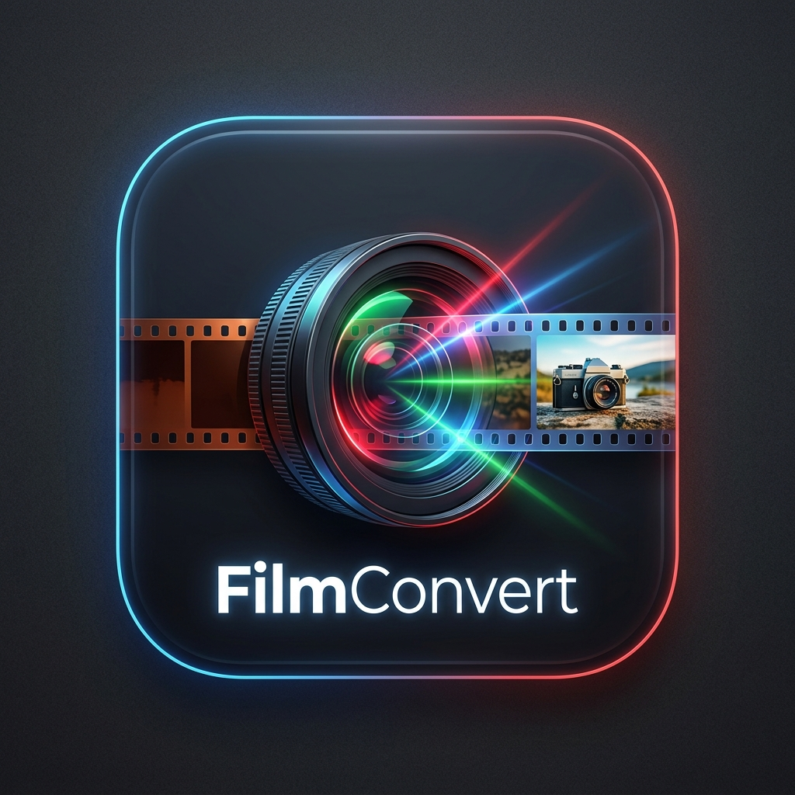
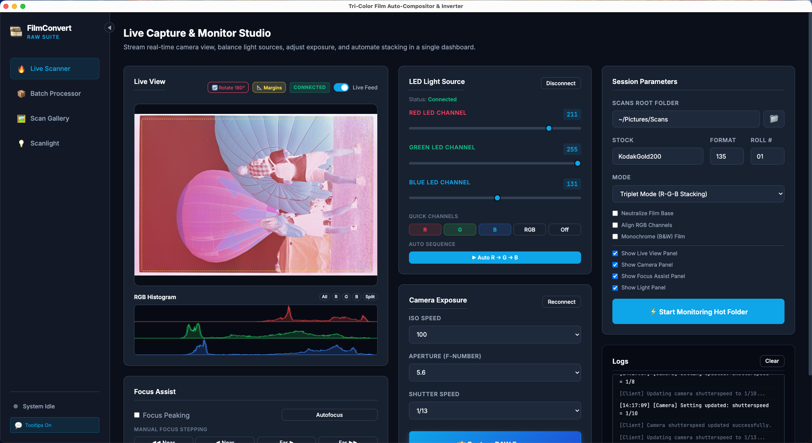
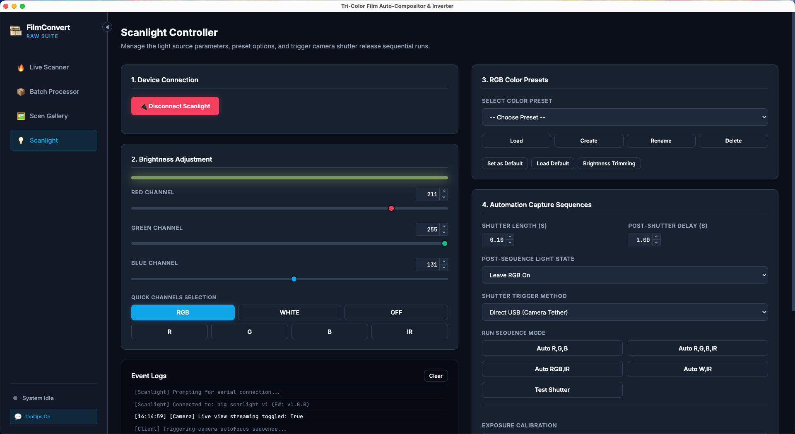

<p align="center">
  
</p>

# FilmConvert: Tri-Color Auto Compositor & Inverter

FilmConvert is an automated application designed for archival film scanning setups. It combines separate Red, Green, and Blue RAW negatives (captured using monochromatic light sources) into high-quality, 16-bit linear composite TIFFs, and accurately inverts them into positive images in real-time.

Whether you are using a manual setup or integrated LED controllers, FilmConvert streamlines your color and black-and-white film archiving pipeline.

---

## Key Features

### 💻 User-Friendly Control Panel
Connect cameras, adjust settings, and monitor folder activities from a unified visual interface.
* **Tethered Camera Controls:** Adjust ISO, Aperture, and Shutter Speed for physical cameras (via `libgphoto2`) directly from your computer.
* **Crop Guides:** Toggle aspect-ratio crop guide overlays on Live View frames.
* **Hot Folder Monitoring:** Auto-stack and auto-invert images as they are captured.



### 🎨 Linear 16-Bit Processing
* **Pure Color Channel Data:** Skips sRGB matrix conversions to avoid cross-channel contamination.
* **Auto-Color Alignment:** Auto-aligns color offsets between shots using FFT phase correlation.
* **Film Base Neutralization:** Analyzes composite data to balance exposure and neutralize orange film masks.

### 🎞️ Density Inversion & curves
* **Linear Density Division:** True mathematical inversion preserving shadow and highlight detail.
* **Auto-Levels & Curves:** Applies photographic S-curves and auto-normalizes output.
* **Monochrome Extraction:** Supports luminance, average, or single-channel extraction (recommending the Green channel for Bayer sensors).

### 💡 Scanlight Controller Integration
* Integrated support for **Jackw01 Big Scanlight** and **Scanlight v4** via the WebSerial API.
* Direct control of sliders, auto-calibration of exposures, and automated capture sequences.



---

## Quick Start (Pre-packaged Desktop App)

The easiest way to run FilmConvert is by downloading the packaged desktop application. You do not need to install Python or build code from source.

1. Download the latest packaged application for your operating system from the [GitHub Releases](https://github.com/Luke-Rand/film-convert/releases) page.
2. Install the application on your computer.
3. *(macOS Users)* Because the application is unsigned, you must bypass Gatekeeper security checks:
   * Drag `FilmConvert.app` to your `/Applications` directory.
   * Open Terminal and execute:
     ```bash
     xattr -d com.apple.quarantine /Applications/FilmConvert.app
     ```
4. *(Optional)* If connecting a **physical camera** (e.g. Nikon mirrorless or Canon DSLR) via USB for tethering, install the system `gphoto2` package:
   * **macOS (via [Homebrew](https://brew.sh/)):** `brew install gphoto2`
   * **Linux (Debian/Ubuntu):** `sudo apt install gphoto2`
5. Launch the **FilmConvert** application to start scanning.

---

## Documentation Directory

To explore advanced configurations, scripts, or contribute to development, see the following documents:

* 📖 **[Command Line (CLI) Usage Guide](CLI_USAGE.md)** — Detailed instructions for running the automated CLI folder monitor (`src/scanning_session.py`), manual stacking CLI (`src/compositor.py`), and density inverter CLI (`src/inverter.py`) with all command line arguments.
* 🛠️ **[Developer & Source Build Guide](DEVELOPMENT.md)** — Guide to setting up virtual environments, installing python bindings/node packages, running in dev modes, and compiling production installers from source.
* 🔌 **[API Reference Documentation](API.md)** — Details of the local backend HTTP endpoints and EventStream protocols.

---

## Credits & Attributions

* The Scanlight control protocols, automatic sequence patterns, and device command structures are adapted from the official [Scanlight Project](https://github.com/jackw01/scanlight) created by [jackw01](https://github.com/jackw01).
