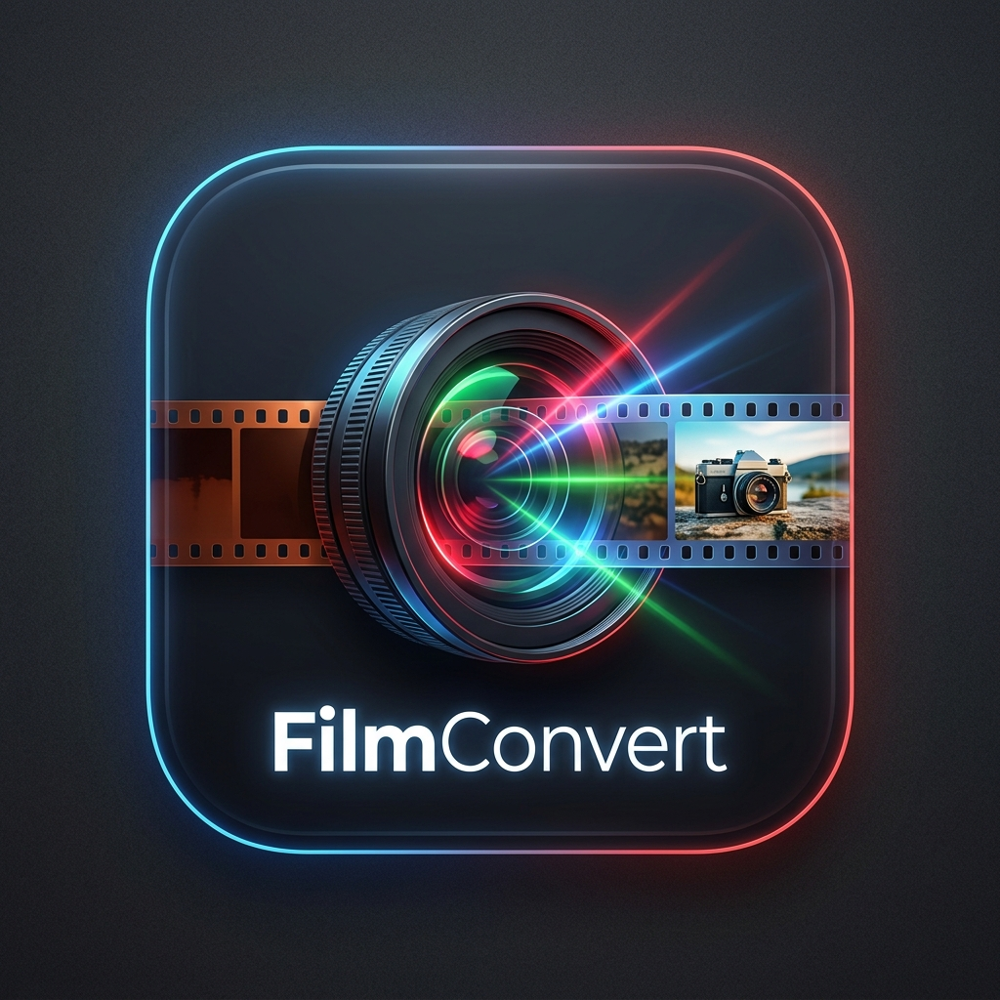
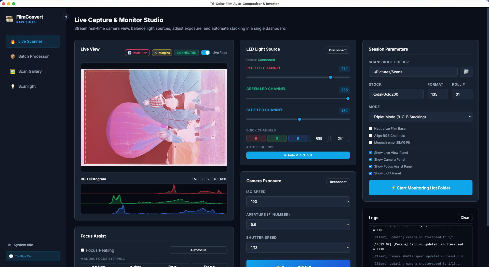
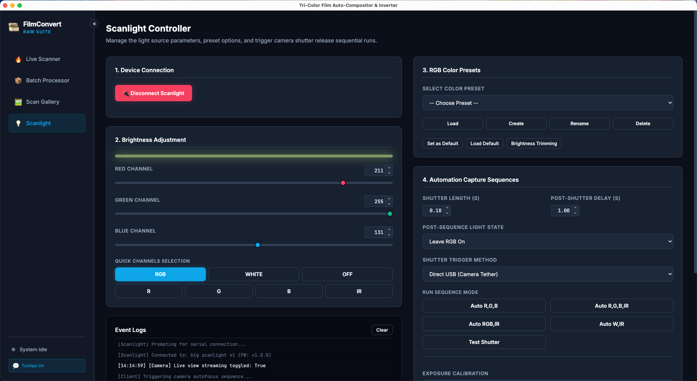

<p align="center">
  
</p>

# FilmConvert: Tri-Color Auto Compositor & Inverter

FilmConvert is an automated application designed for archival film scanning setups. It combines separate Red, Green, and Blue RAW negatives (captured using monochromatic light sources) into high-quality, 16-bit linear composite DNGs, and accurately inverts them into positive images in real-time.

Whether you are using a manual setup or integrated LED controllers, FilmConvert streamlines your color and black-and-white film archiving pipeline.

---

## Key Features

### 💻 User-Friendly Control Panel & Live View
Connect cameras, adjust settings, and monitor folder activities from a unified visual interface.
* **Tethered Camera Controls:** Adjust ISO, Aperture, Shutter Speed, and motorized lens focus steps for physical cameras (via `libgphoto2`) directly from your computer.
* **Focus Peaking & Crop Guides:** Real-time high-contrast edge focus peaking and aspect-ratio crop guide overlays on Live View frames.
* **Hot Folder Monitoring:** Auto-stack triplets and auto-invert images as they are captured in real-time.



### 📋 Archival Contact Sheet & Roll Summary Generator
* **Automatic Roll Summaries:** Generates multi-page PDF documents and high-resolution JPEG contact sheets upon roll completion or on demand.
* **Frame Badges & Exposure Telemetry:** Each thumbnail includes frame number badges, image dimensions, megapixels, shutter speed, aperture, ISO, and camera/lens tags.
* **Custom Themes & Grids:** Supports dark/light visual themes, configurable grid columns (2–8), and embedded roll metadata headers for lab archiving.

### 🎯 Interactive Film Base Neutralization
* **Rebate Eyedropper Tool:** Click directly on unexposed film rebates in the Live View or gallery images to sample orange mask transmissions.
* **Custom Transmission Ratios:** Computes precise per-channel normalization multipliers (`[R, G, B]`) and applies them across single-shot or triplet pipelines.

### 💡 Scanlight Controller & Automated LED Auto-Tuning (ETTR)
* **Scanlight Integration:** Integrated support for **Jackw01 Big Scanlight** and **Scanlight v4** via the WebSerial API.
* **Automated LED Auto-Tuning (ETTR):** Analyzes sensor live view histograms to calculate optimal LED brightness levels, maximizing dynamic range (Expose To The Right) without highlight clipping.
* **Sequential Narrowband Triplet Auto-Tune:** Sequences Red, Green, and Blue illuminants to calibrate balanced multi-spectral exposures.



### 🎛️ Hardware Controller & Keyboard Shortcuts
* **Megalodon KB16 Macropad Support:** Custom VIA keymaps and rotary encoder mappings for hands-on scanning (shutter stepping, fine/coarse focus, autofocus, auto-LED, RGB capture sequence).
* **Comprehensive Keyboard Shortcuts:** Single-key bindings for rapid operation (`Space`/`C` for capture, `U`/`Shift+A` for autofocus, `T` for auto-LED tune, `A` for RGB sequence, `[`/`]` for focus stepping, `?` for shortcuts modal).

### 🎨 16-Bit Linear Processing & True DNG Archival
* **Pure Color Channel Data:** Skips sRGB matrix conversions to eliminate cross-channel spectral contamination.
* **Subpixel Alignment:** FFT phase correlation automatically corrects mechanical shift and chromatic divergence between exposures.
* **True DNG & ICC Color Management:** Outputs compliant Digital Negative (DNG 1.4.0.0) files and 16-bit TIFFs tagged with embedded ICC color profiles (Adobe RGB 1998, ProPhoto RGB / ROMM, sRGB).
* **Lossless Metadata Preservation:** Preserves full camera EXIF and IPTC metadata across all processed composites and positives via `exiftool`.

### 🎞️ Density Inversion, Curves & Reversal Film
* **Sensitometric Inversion:** True linear density division preserving shadow and highlight detail.
* **Auto-Levels & Tone Curves:** Applies configurable black/white clipping, viewing gamma (2.2 or 1.0 linear), and photographic S-curves.
* **Monochrome Extraction:** Supports luminance-weighted, average, or discrete single-channel extraction (Green recommended for Bayer sensors).
* **Slide / Reversal Film Mode:** Native positive processing for color slide film without negative density inversion.

---

## Quick Start (Pre-packaged Desktop App)

The easiest way to run FilmConvert is by downloading the packaged desktop application. You do not need to install Python or build code from source.

1. Download the latest packaged application for your operating system from the [GitHub Releases](https://github.com/Luke-Rand/film-convert/releases) page.
2. Install the application on your computer.
3. *(macOS Users)* Because the application is unsigned, you must bypass Gatekeeper security checks:
   * Drag `FilmConvert.app` to your `/Applications` directory.
   * Open Terminal and execute:
     ```bash
     xattr -d com.apple.quarantine /Applications/FilmConvert.app
     ```
4. *(Optional)* If connecting a **physical camera** (e.g. Nikon mirrorless or Canon DSLR) via USB for tethering, install the system `gphoto2` package:
   * **macOS (via [Homebrew](https://brew.sh/)):** `brew install gphoto2`
   * **Linux (Debian/Ubuntu):** `sudo apt install gphoto2`
5. Launch the **FilmConvert** application to start scanning.

---

## Documentation Directory

To explore advanced configurations, scripts, or contribute to development, see the following documents:

* 📖 **[Command Line (CLI) Usage Guide](CLI_USAGE.md)** — Detailed instructions for running the automated CLI folder monitor (`src/scanning_session.py`), manual stacking CLI (`src/compositor.py`), density inverter CLI (`src/inverter.py`), archival contact sheet generator (`src/contact_sheet.py`), and batch roll reprocessor (`reprocess_rolls.py`).
* 🛠️ **[Developer & Source Build Guide](DEVELOPMENT.md)** — Complete developer guide detailing virtual environment setup, PyInstaller packaging, macOS USB daemon management, architecture subsystems (multiprocessing, Pydantic schemas, ICC profiles), and running Pytest & Playwright test suites.
* 🔌 **[API Reference Documentation](API.md)** — Comprehensive specification of the REST endpoints, Pydantic validation models, and Server-Sent Events (SSE) stream.
* 🎛️ **[Megalodon KB16 Macropad & Shortcuts Setup Guide](docs/MACROPAD_SETUP.md)** — Hardware layout, VIA JSON configuration, rotary encoder assignments, and workflow shortcuts.

---

## Credits & Attributions

* The Scanlight control protocols, automatic sequence patterns, and device command structures are adapted from the official [Scanlight Project](https://github.com/jackw01/scanlight) created by [jackw01](https://github.com/jackw01).

---

## License

This project is licensed under the GNU General Public License v3.0 - see the [LICENSE](LICENSE) file for details.
